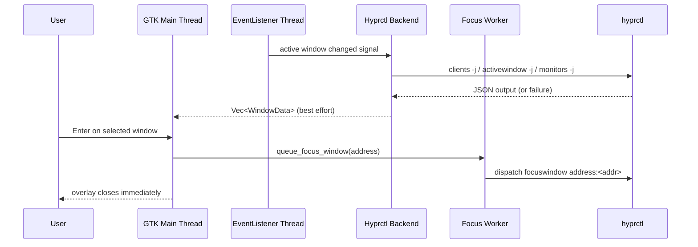

# Architecture Concept: Decoupled, Panic-Safe Window Switcher

This project uses a **decoupled architecture** to keep the GTK main thread responsive and prevent crashes from third-party IPC wrappers.

## Why We Refactored

The old path relied on `hyprland-rs` data macros. In some failure cases, those internals could panic due to `.expect()` usage.  
The current architecture avoids that risk by:

1. Fetching state through native `hyprctl ... -j` commands.
2. Parsing JSON with `serde`/`serde_json`.
3. Treating command/parse errors as **non-fatal** (graceful failover).

## Core Components

| Component | Responsibility | Safety Rule |
| --- | --- | --- |
| `src/ui/*` | Draw overlay, handle key navigation, close instantly on Enter/Escape | Never block on compositor I/O |
| `EventListener` thread | Receive active-window change signals | Signal-only, no heavy work |
| `refresh_and_send` | Pull clients/active window/monitors via `hyprctl` | No `unwrap()` / no `expect()` |
| Focus worker queue | Run `hyprctl dispatch focuswindow` off the UI thread | Queue + background worker + logging |
| Snapshot daemon | Capture previous active workspace thumbnail | Fire-and-forget async call |
| Thumbnail GC | Remove stale `<address>.png` files | Best-effort, non-blocking cleanup |

## Data Flow (Read Path)

1. Listener receives `activewindow` signal.
2. Backend runs `hyprctl clients -j`.
3. Backend parses JSON into typed structs and builds `Vec<WindowData>`.
4. Backend sends window list to GTK via async channel.
5. GTK renders thumbnails from `/tmp/switcher-thumbnails`.

If any `hyprctl` command fails or JSON is malformed, that cycle is skipped safely without crashing the app.

## Data Flow (Write Path: Focus)

1. User presses Enter.
2. UI enqueues the selected address into a bounded queue.
3. Worker thread executes `hyprctl dispatch focuswindow address:<addr>`.
4. UI closes immediately (no wait).

Errors are logged to `stderr` and `/tmp/window-switcher-focus.log`.

## Sequence Diagram

This design gives you low latency, panic safety, and clear observability boundaries.
