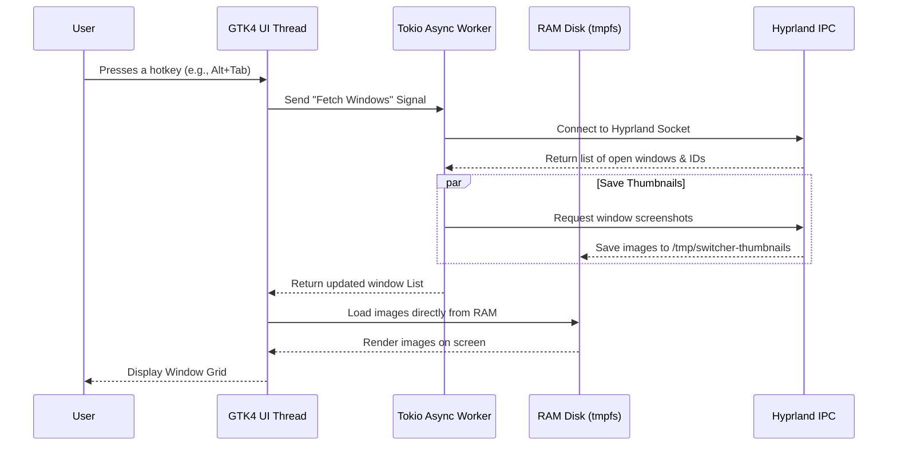

# Architecture Concept: Building a Hyprland Visual Switcher

Welcome! In this tutorial, we will learn how to build a lightning-fast visual window switcher for Hyprland using Rust. Before we write the code, we need to understand the structural design.

## Learning Prerequisites (IDD)
> [!NOTE]
> To get the most out of this tutorial, you should be familiar with:
> - **Basic Rust:** Structs, Enums, and basic error handling.
> - **Linux Basics:** Knowing what a window manager is (specifically Wayland and Hyprland).
> - **Mental Model:** Programs in Linux can talk to each other using an IPC (Inter-Process Communication) Unix Socket. We will also utilize an *Isolated UI* pattern to separate the drawing logic from the system monitor.

## The "Snapshot Caching + Isolated UI" Pattern
To make the window switcher feel smooth and instantaneous, we use a technique called **Snapshot Caching** paired with an **Isolated UI**.

### What does this mean?
1. **Snapshot Caching:** Instead of reading images from a slow hard drive, we save screenshots of your windows directly into the computer's memory (RAM) via a `tmpfs` (temporary file system). When the UI needs to show a window preview, it fetches the image from RAM, bypassing disk latency entirely.
2. **Isolated UI:** Our user interface is drawn using GTK4 and Layer Shell. It acts like an independent transparent glass overlay sitting on top of your screen. It listens for your keyboard inputs without messing with Hyprland's internal rendering. 

This **synergy** (working together smoothly) prevents the UI thread from freezing when your computer is busy doing heavy tasks!

### How the Data Flows
Here is a sequence diagram showing how the components talk to one another. Notice how the logic is divided into an Async Thread (handling background tasks) and a UI Main Thread (handling the graphics).

With this architecture, the UI stays fully responsive because the heavy lifting (talking to Hyprland and fetching images) is handled by the async worker. Let's move on to setting up our environment!
